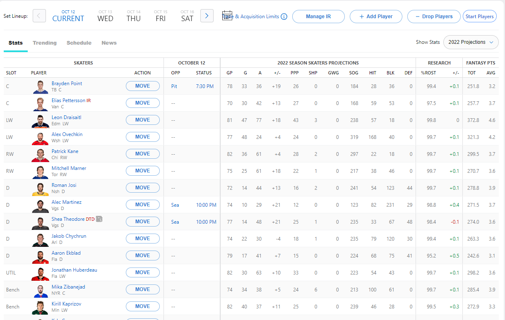

# ESPN-Start-Players

## Description

In ESPN fantasy hockey, you must manually set your lineup every day to ensure that you achieve maximum points and give yourself the best chance at winning. In other fantasy hockey applications, there is a "start players" button for the week which ensures that all players for that week are set up so that you don't have to do it manually. I decided to implement this feature for ESPN by creating a chrome extension that can be used to start all players when accessing fantasy hockey through the ESPN website.

---

## Instructions

1. Install through Chrome Extensions (Currently Unavailable)
*Feature will be available upon extension approval*

2. Download code
- First download or clone the repository
- Unzip the file
- Next, open Google Chrome and open the extensions tab and click *Manage Extensions*
- In the top left corner of the screen, click *Load Unpacked*
- Select the file location of the unzipped folder
- If not already turned on, click the slider in the ESPN Start Players box
- Go to https://fantasy.espn.com/hockey/ and go into your league
- Select your team and you should see a button next to drop players that says *Start Players*

---

## Screenshots
The start button is added to the top right of the screen

Kyle Connor is on the bench when there are open positions he could be put in to play

After pressing the start button, Connor is replaced with Kaprizov and is now in the starting lineup

